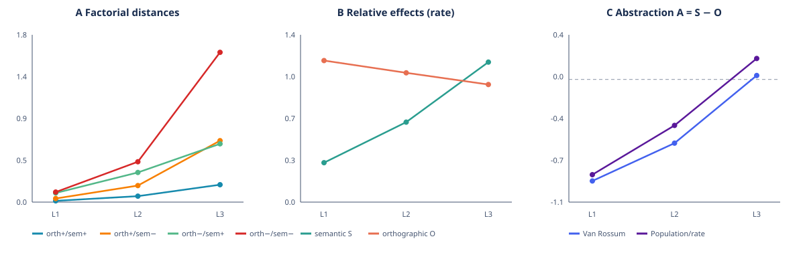

# E1 — Hierarchical orthographic-to-semantic organization in a recurrent SNN

[](https://github.com/Danval-003/snn-semantic-dynamics/actions/workflows/ci.yml)
[](LICENSE)

**[📄 Manuscript](paper/orthographic-to-semantic-abstraction.pdf) · [💻 Code](https://github.com/Danval-003/snn-semantic-dynamics) · [📊 Frozen v1.0 results](docs/RESULTS.md) · [🔬 E1.5 mechanics](docs/MECHANISTIC_RESULTS.md) · [🧪 Reproduce](docs/REPRODUCIBILITY.md)**

E1 is a small, CPU-reproducible study of whether a recurrent spiking neural
network can transform grapheme events into semantically organized neural
activity without BPE, word embeddings, attention, Transformers, or pretrained
semantic representations.

The current model has **18,128 parameters**. Its forward pass is genuinely
spiking; semantic supervision acts directly on population spike trains through
a multiscale Van Rossum triplet loss.

> Current result: ordered sequential processing is required to construct the
> representation, while the final semantic organization is expressed mainly
> as a sparse population/rate code rather than precise output spike timing.

This is supervised semantic organization—not unsupervised semantic emergence.



## Main findings

- The SNN reaches `0.913` IID population-code triplet accuracy across five seeds.
- Shuffling final spike timing does little; rate-only retains the result.
- Permuting input graphemes reduces SNN accuracy from `0.913` to `0.654`.
- A curated 2×2 diagnostic changes from orthographic dominance in L1/L2 to
  semantic dominance in the L3 rate code: `A = −0.854 → −0.413 → +0.188`.
- Heterogeneous learnable membrane dynamics outperform one fixed time constant
  on hard orthographic distractors: `0.640 vs 0.490` temporal STA.
- Relation-disjoint SNN generalization reaches `0.778`.
- Context-supervised exposure transfers new lexemes to isolated-word tests:
  `0.487 → 0.758` for the SNN.

## Paired continuous ANN baseline

The ANN uses the same input, depth, widths, recurrence, adaptation, temporal
parameters, training data, seeds, and **18,128 parameters**. Binary spikes are
replaced by continuous adaptive leaky-tanh states.

| Metric | SNN | ANN | Paired interpretation |
|---|---:|---:|---|
| IID population STA | 0.913 | **0.928** | No conclusive difference |
| Hard orthographic STA | **0.720** | 0.540 | SNN +0.180 [0.040, 0.360] |
| Factorial abstraction `A₃` | **0.188** | 0.141 | No conclusive difference |
| Accuracy drop after input permutation | **0.259** | 0.133 | SNN is more order-dependent |
| Relation-disjoint STA | 0.778 | **0.906** | ANN generalizes better |
| Contextual lexical transfer | 0.758 | **0.833** | ANN generalizes better |

The layer-wise form→semantics transformation is therefore **not unique to
spikes**. The SNN's current distinctive properties are sparsity, stronger order
dependence, and better separation of orthographically deceptive examples. A
spike rate of `0.090` versus `0.986` ANN states above `|10⁻³|` is operationally
informative but is not an energy comparison.

## Architecture

```text
grapheme events (one-hot channels, fixed timing)
        ↓
recurrent adaptive spiking layer — fast
        ↓
recurrent adaptive spiking layer — intermediate
        ↓
recurrent adaptive spiking layer — slow/conceptual
        ↓
binary population trajectory [time, neurons]
```

Each layer has recurrent connections, adaptive thresholds, and heterogeneous
learnable membrane decay. A silent post-stimulus window measures persistent
state. The paired ANN mirrors this hierarchy with continuous units.

## Reproduce

Requirements: Linux/macOS, Python 3.11–3.13, and `uv`. PyTorch is pinned to its
CPU-only index; no GPU is required.

```bash
uv sync --extra dev
uv run pytest
uv run e1-smoke --epochs 5
```

Convenience commands:

```bash
make test       # unit tests
make data       # regenerate the tracked, human-auditable dataset exports
make quick      # tests + short smoke run
make full       # all experiments, summaries, and figures
make figures    # regenerate tracked SVG figures from run artifacts
make mechanistic # frozen-checkpoint settling analysis; no retraining
```

## E1-v2 release: mechanistic settling extension

The `e1-mechanistic` branch preserves `v1.0-e1` as an exact legacy mode and
adds explicit settling relative to each word's final event. It evaluates five
non-interchangeable readouts and four post-stimulus causal interventions on
frozen SNN/ANN checkpoints. A second, balanced 48-pair lexical set is evaluated
without entering training.

The main SNN result replicates across both pair sets: layer-3 integrated
abstraction changes from negative at stimulus offset zero to positive after 12
silent recurrent steps. Removing recurrent communication reduces this change;
resetting state abolishes it. See
[the E1.5 mechanistic report](docs/MECHANISTIC_RESULTS.md) for claim boundaries
and [the E1-v2 release record](docs/RELEASE_E1_V2.md) for the frozen snapshot.

The full suite runs five seeds and takes roughly 15–25 minutes on a typical
CPU. Generated checkpoints and detailed per-seed artifacts live under `runs/`
and are ignored by Git. Compact results and figures under `reports/` are
versioned.

## Repository map

```text
configs/                  experiment configurations
data/                     audited, versioned evaluation pairs
data/generated/           exact generated train/test manifests
docs/MECHANISTIC_RESULTS.md frozen-checkpoint E1.5 results
docs/EXPERIMENT.md        full protocol and detailed results
docs/RESEARCH_LOG.md      chronological research decisions
docs/RESULTS.md           frozen result tables and claim boundaries
docs/PAPER_OUTLINE.md     working six-page manuscript outline
docs/REPRODUCIBILITY.md   protocols, runtimes, and exact commands
reports/                  compact results and tracked figures
paper/                    current manuscript PDF
scripts/                  complete and quick reproduction entry points
src/e1_spikes/            models, metrics, controls, and runners
tests/                    mechanical and split-integrity tests
```

## Claim boundaries

E1 currently supports a layer-wise shift from orthographic to semantic
organization under supervised training. It does **not** establish unsupervised
language acquisition, broad lexical generalization, energy efficiency,
reasoning, text generation, or superiority of SNNs over ANNs. The contextual
transfer experiment is semantically supervised at the sentence level; it is
not unsupervised corpus exposure.

See [the frozen results](docs/RESULTS.md), [the research log](docs/RESEARCH_LOG.md),
and [the full protocol](docs/EXPERIMENT.md).

The exact fixed-validation, relation-disjoint, contextual-transfer, and lexical
holdout datasets are exported under [`data/generated/`](data/generated/). Run
`make data` to regenerate them; CI verifies that these files remain identical
to the constructors used by the experiments. Per-seed headline metrics are
preserved in [`reports/raw_metrics.jsonl`](reports/raw_metrics.jsonl), allowing
confidence intervals to be recomputed without retraining.

## License

Released under the [MIT License](LICENSE).
